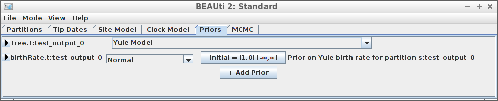
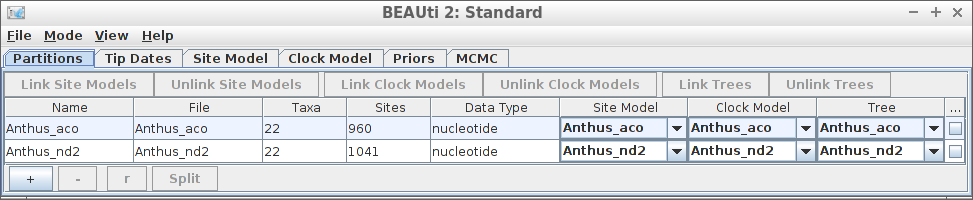

# Examples

 * Want something more interactive? [beastier](https://github.com/richelbilderbeek/lumier) 
   is an R Shiny app to help create the R function call needed!

For all examples, do load `babette`:

```
library(babette)
```

All examples read the alignment from a FASTA file (usually `my_fasta.fas`) 
and create a BEAST2 input file called `my_beast.xml`.

## Example #1: all default

Using all default settings, only specify a DNA alignment.


```
posterior <- bbt_run(
  "test_output_0.fas"
)
```

All other parameters are set to their defaults, as in BEAUti.

## Example #2: fixed crown age

Using all default settings, only specify a DNA alignment.

```
[No screenshot, as this cannot be done in BEAUti yet]
```

```
posterior <- bbt_run(
  "my_fasta.fas",
  posterior_crown_age = 15
)
```

An alternative is to date the node of the most recent common ancestor
of all taxa:


```{r example_2_mrca, cache=FALSE}
posterior <- bbt_run(
  "my_fasta.fas",
  mcmc = mcmc,
  mrca_priors = create_mrca_prior(
    taxa_names = get_taxa_names("my_fasta.fas"),
    alignment_id = get_alignment_id("my_fasta.fas"),
    is_monophyletic = TRUE,
    mrca_distr = create_normal_distr(
      mean = create_mean_param(value = 15.0, estimate = FALSE),
      sigma = create_sigma_param(value = 0.025, estimate = FALSE)
    )
  )
)
```

Here we use an MRCA prior with fixed (non-estimated) values of the mean
and standard deviation for the common ancestor node's time.


## Example #3: JC69 site model


```
posterior <- bbt_run(
  "my_alignment.fas",
  site_models = create_jc69_site_model()
)
```

## Example #4: Relaxed clock log normal


```{r example_4}
posterior <- bbt_run(
  "my_alignment.fas",
  clock_models = create_rln_clock_model()
)
```

## Example #5: Birth-Death tree prior


```{r example_5}
posterior <- bbt_run(
  "my_alignment.fas",
  tree_priors = create_bd_tree_prior() 
)
```

## Example #6: Yule tree prior with a normally distributed birth rate



```{r example_6}
posterior <- bbt_run(
  "my_alignment.fas",
  tree_priors = create_yule_tree_prior(
    birth_rate_distr = create_normal_distr()
  ) 
)
```

Thanks to Yacine Ben Chehida for this use case

## Example #7: HKY site model with a non-zero proportion of invariants


```{r example_7}
posterior <- bbt_run(
  "my_alignment.fas",
  site_models = create_hky_site_model(
    gamma_site_model = create_gamma_site_model(prop_invariant = 0.5)
  )
)
```

Thanks to Yacine Ben Chehida for this use case

## Example #8: Strict clock with a known clock rate


```{r example_8}
posterior <- bbt_run(
  "my_alignment.fas",
  clock_models = create_strict_clock_model(
    clock_rate_param = create_clock_rate_param(value = 0.5)) 
)
```

Thanks to Paul van Els and Yacine Ben Chehida for this use case.

## Example #9: Two alignments



```{r example_9}
posterior <- bbt_run(
  c("anthus_aco.fas", "anthus_nd2.fas")
)
```

Thanks to Paul van Els for this use case and supplying these FASTA files.

## Example #10: Two alignments, different site models


```{r example_10}
babette::posterior <- bbt_run(
  c("anthus_aco.fas", "anthus_nd2.fas"),
  site_models = list(
    create_hky_site_model(), 
    create_tn93_site_model()
  )
)
```

Since `v1.12` this it is supported to have two alignments with different site models, clock models and tree priors.

Thanks to Paul van Els for this use case.
