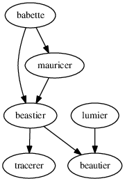

# FAQ

## BEAST2

### Which version of BEAUti do you use as a guideline?

Version 2.5.0, as can be found in the [install_beast2](https://github.com/richelbilderbeek/beastier/blob/master/R/install_beast2.R) function.

### How to install BEAST2?

```
beastier::install_beast2()
```

## `babette` development 

### What's the road map?

Currently, `babette` does not have a road map itself, but `beautier` does:

 * [beautier road map](https://github.com/richelbilderbeek/beautier/blob/master/road_map.md)

### How can I indicate a feature that I miss?

Submit an Issue.

### How can I submit code?

See [CONTRIBUTING](../CONTRIBUTING.md), at 'Submitting code'

### How can I submit a bug?

See [CONTRIBUTING](../CONTRIBUTING.md), at 'Submitting bugs' 

### How can I indicate something else?

Submit an Issue. Or send an email to Richel Bilderbeek.

### What are the `babette` dependencies?



## `babette` technical questions

### How can I inspect a generated BEAST2 XML file?

Set a path to a desired location and disable cleaning up:

```
out <- bbt_run(
  fasta_filenames = get_babette_path("anthus_aco_sub.fas"),
  beast2_input_filename = "/home/richelbilderbeek/beast2.xml",
  cleanup = FALSE
)
```

The XML file will be saved at that location.

### If I set a fixed crown age with multiple alignments, only the first alignment has so

Correct. This is a feature of BEAST2. Using the `create_mrca` prior 
gives prettier results.

## `babette` in academia

### How do I reference to this work?

```
Bilderbeek, Richèl JC, and Rampal S. Etienne. "babette: BEAUti 2, BEAST 2 and Tracer for R." Methods in Ecology and Evolution (2018).
```

or

```
@article{bilderbeek2018babette,
  title={babette: BEAUti 2, BEAST 2 and Tracer for R},
  author={Bilderbeek, Richèl JC and Etienne, Rampal S},
  journal={Methods in Ecology and Evolution},
  year={2018},
  publisher={Wiley Online Library}
}
```

### Are there any related packages?

 * [lumier](https://github.com/richelbilderbeek/lumier): Shiny app to help create the function call needed
 * [BEASTmasteR](https://github.com/nmatzke/BEASTmasteR): tip-dating analyses using fossils as dated terminal taxa
 * [RBeast](https://github.com/beast-dev/RBeast): misc other things


### What are the FASTA files?

FASTA files `anthus_aco.fas` and `anthus_nd2.fas` from:
 
 * Van Els, Paul, and Heraldo V. Norambuena. "A revision of species limits in Neotropical pipits Anthus based on multilocus genetic and vocal data." Ibis.

Thanks to Paul van Els.

## `babette` misc

### Why the name?

 * `ba`: BeAutier
 * `bet`: BEasTier
 * `te`: TracErer

Later on, `mauricer` got added.

### Why the logo?

Initially, the logo was a low-tech remake of Babette, a maid in Beauty and the Beast. 
To prevent problems with Disney, a different logo was picked.

The current logo shows a swan, an animal considered to be graceful.
The swan is drawn by Jose Scholte, who kindly allowed her work to
be used for free, by attribution.

## Error: `libjvm.so: cannot open shared object file: No such file or directory`

For me, [this Stack Overflow post](https://stackoverflow.com/a/25932828) helped me out:

```
sudo mousepad /etc/ld.so.conf.d/java.conf
```

In that file put:

```
/usr/lib/jvm/java-8-oracle/jre/lib/amd64
/usr/lib/jvm/java-8-oracle/jre/lib/amd64/server
```

Save, close, restart R studio, fixed!

Else [this Stack Overflow post may be helpful](https://stackoverflow.com/a/43466434):

```
sudo apt-get install jdk-*
sudo R CMD javareconf
sudo R CMD javareconf -e
export LD_LIBRARY_PATH=$JAVA_LD_LIBRARY_PATH
sudo apt-get install r-cran-rjava
```

### How to create the dependency graph from the `.dot` file?

```
dot -Tps dependencies.dot -o dependencies.ps
convert dependencies.ps dependencies.png
```
