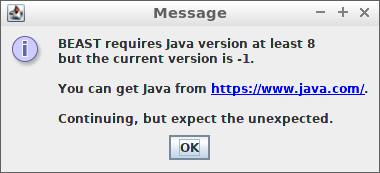
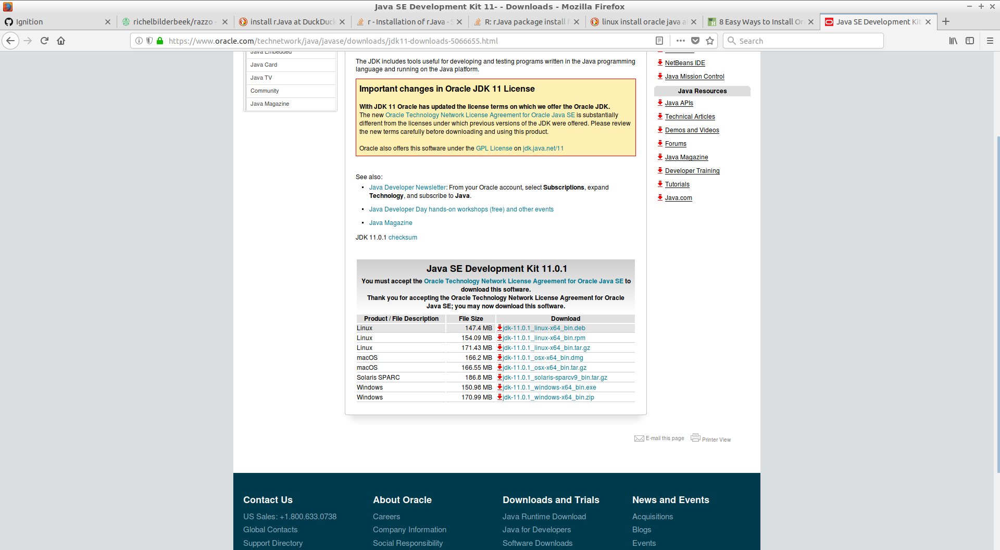
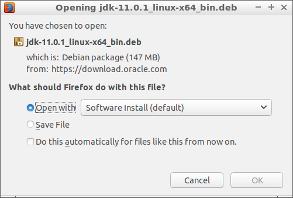
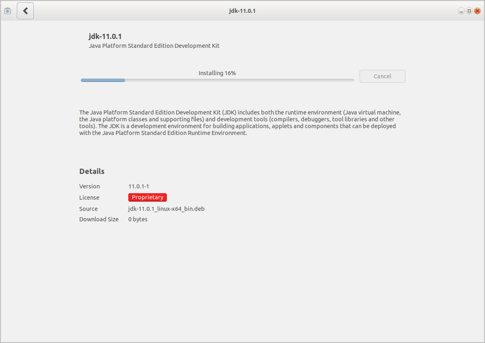

# `rJava` questions

How to install `rJava` under different operating systems

 * Installation
 * Troubleshooting

## Installation

### Mac OS

On Travis, I do:

```
R CMD javareconf
R --quiet -e 'install.packages("rJava", type="source", repos="http://cran.us.r-project.org")'
```

May work for you as well.

### Ubuntu 14.5 (Trusty Tahr)

The `.travis.yml` file shows a Trusty install:

```
 - sudo apt-get install -qq oracle-java8-installer # Java 8
 - sudo apt-get install oracle-java8-set-default
```


So I assume the same can be achieved with:

```
sudo add-apt-repository -y ppa:webupd8team/java 
sudo apt-get update -qq
sudo apt-get install oracle-java8-installer
sudo apt-get install oracle-java8-set-default
```

### Ubuntu 17.10 (Artful Aardvark)

```
sudo apt-get install r-cran-rjava openjdk-8-jdk
R CMD javareconf
```

Do not use `openjdk-9-jdk`.

### Ubuntu 18.4 (Bionic Beaver)

The `.travis.yml` file shows a Trusty install:

```
# - sudo apt install -qq oracle-java8-installer # Java 8
# - sudo apt install oracle-java8-set-default
```

On Bionic, I achieved the same with approx:

```
sudo add-apt-repository ppa:marutter/c2d4u3.5
sudo apt update
sudo apt grade
sudo apt install r-cran-rjava
sudo apt-get install openjdk-11-jdk
sudo R CMD javareconf
```

```
#sudo add-apt-repository -y ppa:webupd8team/java 
#sudo apt-get update -qq
#sudo apt-get install oracle-java8-installer
#sudo apt-get install oracle-java8-set-default
```


## Troubleshooting

### Error: `libjvm.so: cannot open shared object file: No such file or directory`

#### Random solution 1

Sometimes works:

For me, [this Stack Overflow post](https://stackoverflow.com/a/25932828) helped me out:

```
sudo mousepad /etc/ld.so.conf.d/java.conf
```

In that file put:

```
/usr/lib/jvm/java-8-oracle/jre/lib/amd64
/usr/lib/jvm/java-8-oracle/jre/lib/amd64/server
```

Save, close, restart R studio, fixed!

#### Random solution 2

Random notes:

Else [this Stack Overflow post may be helpful](https://stackoverflow.com/a/43466434):

Ruthlessly install all JDK stuff:

```
sudo apt-get install jdk-*
```

```
sudo R CMD javareconf
```

```
sudo R CMD javareconf -e
export LD_LIBRARY_PATH=$JAVA_LD_LIBRARY_PATH
sudo apt-get install r-cran-rjava
```

### BEAST2 cannot find Java




Download the Oracle Java SDK:



Open the Oracle Java SDK with the package installer:



Install the Oracle Java SDK with the package installer:



Pick the right `java`:


```
sudo update-alternatives --config java
```

I picked:

```
There are 5 choices for the alternative java (providing /usr/bin/java).

  Selection    Path                                            Priority   Status
------------------------------------------------------------
  0            /usr/lib/jvm/java-9-openjdk-amd64/bin/java       1091      auto mode
  1            /usr/bin/gij-4.8                                 1048      manual mode
  2            /usr/bin/gij-5                                   1050      manual mode
* 3            /usr/bin/gij-6                                   1060      manual mode
  4            /usr/lib/jvm/java-8-openjdk-amd64/jre/bin/java   1081      manual mode
  5            /usr/lib/jvm/java-9-openjdk-amd64/bin/java       1091      manual mode

Press <enter> to keep the current choice[*], or type selection number: 
```

Reconfig:

```
sudo R CMD javareconf
```
