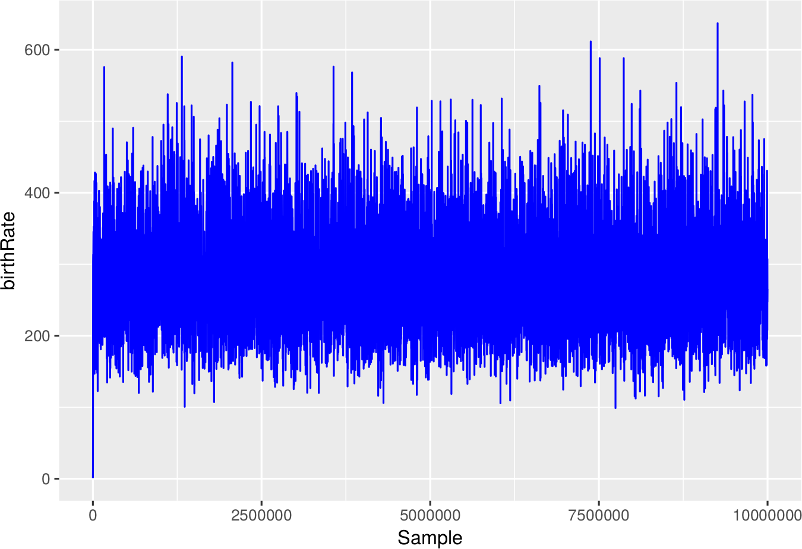

# Examples

## One alignment

Running a default BEAST2 run on an example FASTA file:

```{r}
library(babette)
out <- run_beast2(get_path("anthus_aco.fas"))
```

Plotting the estimated (Yule model) birth rate:

```{r}
ggplot2::ggplot(
  data = out$estimates,
  ggplot2::aes(x = Sample)
) + ggplot2::geom_line(ggplot2::aes(y = birthRate))

```



Showing the effective sample sizes, with 20% burn-in removed:

```{r}
traces <- tracerer::remove_burn_ins(traces = out$estimates, burn_in_fraction = 0.2)
esses <- t(tracerer::calc_esses(traces, sample_interval = sample_interval))
colnames(esses) <- "ESS"
knitr::kable(esses)
```


## Two alignments

Running a default BEAST2 run on two example FASTA files:

```{r}
out <- run_beast2(
  get_paths(c("anthus_aco.fas", "anthus_nd2.fas"))
)
```

Analysis same as above.

## Two alignments, fixed crown age

Running a default BEAST2 run on two example FASTA files,
with a fixed posterior crown age:

```{r}
out <- run_beast2(
  get_paths(c("anthus_aco.fas", "anthus_nd2.fas")),
  posterior_crown_age = 15
)
```

Analysis same as above.
