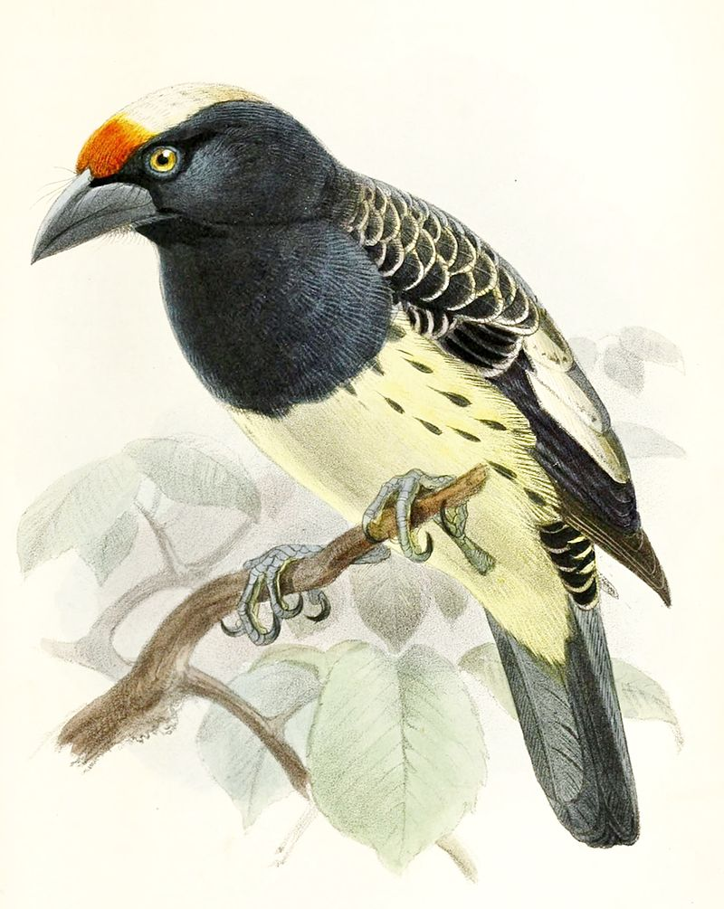

# `pics`

Pictures for `babette`.

## Attribution

### Swan


The swan is drawn by Jose Scholte, who kindly allowed her work to be used for free, by attribution.

### `babette` logo

The logo is created by Richel J.C. Bilderbeek, by modifying the swan picture and merging it with the R logo.


### Orange-fronted barbet 



 * By John Gerrard Keulemans - The Ibis, ser. 3, vol. 6, Public Domain, https://commons.wikimedia.org/w/index.php?curid=14887149

## Convert the fuzzy white background of swan picture to one single color

```
convert swan.png -fuzz 15% -fill white -opaque white swan_mono_background.png
convert swan_mono_background.png -background white -alpha remove swan_mono_background_2.png
```
