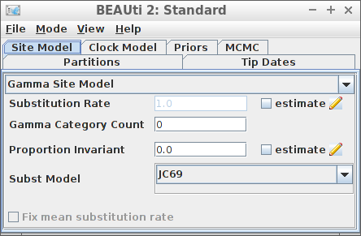

```{r setup, include = FALSE}
knitr::opts_chunk$set(
  collapse = TRUE,
  comment = "#>"
)
```

```{r create_files, include = FALSE}
file.copy(rbeast2::get_path("anthus_aco.fas"), "test_output_0.fas")
file.copy(rbeast2::get_path("anthus_aco.fas"), "my_fasta.fas")
file.copy(rbeast2::get_path("anthus_aco.fas"), "my_alignment.fas")
file.copy(rbeast2::get_path("anthus_aco.fas"), "anthus_aco.fas")
file.copy(rbeast2::get_path("anthus_nd2.fas"), "anthus_nd2.fas")
```

# Examples

For all examples, do load `rbeast2`:

```{r load_rbeast2, results='hide', warning=FALSE, error=FALSE, message=FALSE}
library(rbeast2)
```

All these examples assume that `BEAST2` is installed at the default 
location at `r get_default_beast2_jar_path()`.

All examples read the alignment from a FASTA file (usually `my_fasta.fas`).
Instead of a full run, the MCMC chain length is shortened to 10K states,
with a measurement every 1K states:

```{r}
mcmc <- create_mcmc(chain_length = 10000, store_every = 1000)
```

## Example #1: all default

Using all default settings, only specify a DNA alignment.


```{r example_1, cache=TRUE}
posterior <- run_beast2(
  "test_output_0.fas",
  mcmc = mcmc
)
```

All other parameters are set to their defaults, as in BEAUti.

```{r fig.width=7, fig.height=7}
ggplot2::ggplot(
  data = posterior$estimates,
  ggplot2::aes(x = Sample)
) + ggplot2::geom_line(ggplot2::aes(y = birthRate))
plot_densitree(posterior$test_output_0_trees, width = 2)
```

## Example #2: fixed crown age

Using all default settings, only specify a DNA alignment.

```
[No screenshot, as this cannot be done in BEAUti yet]
```

```{r example_2, cache=TRUE}
posterior <- run_beast2(
  "my_fasta.fas",
  posterior_crown_age = 15,
  mcmc = mcmc
)
```

`fasta_to_phylo` creates a random phylogeny from
a FASTA file of a certain crown age. 

```{r fig.width=7, fig.height=7}
ggplot2::ggplot(
  data = posterior$estimates,
  ggplot2::aes(x = Sample)
) + ggplot2::geom_line(ggplot2::aes(y = birthRate))
plot_densitree(posterior$my_fasta_trees, width = 2)
```

## Example #3: JC69 site model



```{r example_3, cache=TRUE}
posterior <- run_beast2(
  "my_alignment.fas",
  site_models = create_jc69_site_model(),
  mcmc = mcmc
)
```

```{r fig.width=7, fig.height=7}
ggplot2::ggplot(
  data = posterior$estimates,
  ggplot2::aes(x = Sample)
) + ggplot2::geom_line(ggplot2::aes(y = birthRate))
plot_densitree(posterior$my_alignment_trees, width = 2)
```

## Example #4: Relaxed clock log normal


```{r example_4, cache=TRUE}
posterior <- run_beast2(
  "my_alignment.fas",
  clock_models = create_rln_clock_model(),
  mcmc = mcmc
)
```

```{r fig.width=7, fig.height=7}
ggplot2::ggplot(
  data = posterior$estimates,
  ggplot2::aes(x = Sample)
) + ggplot2::geom_line(ggplot2::aes(y = birthRate))
plot_densitree(posterior$my_alignment_trees, width = 2)
```

## Example #5: Birth-Death tree prior


```{r example_5, cache=TRUE}
posterior <- run_beast2(
  "my_alignment.fas",
  tree_priors = create_bd_tree_prior(), 
  mcmc = mcmc
)
```

```{r fig.width=7, fig.height=7}
ggplot2::ggplot(
  data = posterior$estimates,
  ggplot2::aes(x = Sample)
) + ggplot2::geom_line(ggplot2::aes(y = BDBirthRate))
plot_densitree(posterior$my_alignment_trees, width = 2)
```

## Example #6: Yule tree prior with a normally distributed birth rate


```{r example_6, cache=TRUE}
posterior <- run_beast2(
  "my_alignment.fas",
  tree_priors = create_yule_tree_prior(
    birth_rate_distr = create_normal_distr(
      mean = create_mean_param(value = 1.0),
      sigma = create_sigma_param(value = 0.1)
    )
  ),
  mcmc = mcmc
)
```

```{r fig.width=7, fig.height=7}
ggplot2::ggplot(
  data = posterior$estimates,
  ggplot2::aes(x = Sample)
) + ggplot2::geom_line(ggplot2::aes(y = birthRate))
plot_densitree(posterior$my_alignment_trees, width = 2)
```

Thanks to Yacine Ben Chehida for this use case

## Example #7: HKY site model with a non-zero proportion of invariants


```{r example_7, cache=TRUE}
posterior <- run_beast2(
  "my_alignment.fas",
  site_models = create_hky_site_model(
    gamma_site_model = create_gamma_site_model(prop_invariant = 0.5)
  ),
  mcmc = mcmc
)
```

```{r fig.width=7, fig.height=7}
ggplot2::ggplot(
  data = posterior$estimates,
  ggplot2::aes(x = Sample)
) + ggplot2::geom_line(ggplot2::aes(y = birthRate))
plot_densitree(posterior$my_alignment_trees, width = 2)
```

Thanks to Yacine Ben Chehida for this use case

## Example #8: Strict clock with a known clock rate


```{r example_8, cache=TRUE}
posterior <- run_beast2(
  "my_alignment.fas",
  clock_models = create_strict_clock_model(
    clock_rate_param = create_clock_rate_param(value = 0.5)
  ), 
  mcmc = mcmc
)
```

```{r fig.width=7, fig.height=7}
ggplot2::ggplot(
  data = posterior$estimates,
  ggplot2::aes(x = Sample)
) + ggplot2::geom_line(ggplot2::aes(y = birthRate))
plot_densitree(posterior$my_alignment_trees, width = 2)
```

Thanks to Paul van Els and Yacine Ben Chehida for this use case.

## Example #9: Two alignments


```{r example_9, cache=TRUE}
posterior <- run_beast2(
  c("anthus_aco.fas", "anthus_nd2.fas"),
  mcmc = mcmc
)
```

```{r fig.width=7, fig.height=7}
ggplot2::ggplot(
  data = posterior$estimates,
  ggplot2::aes(x = Sample)
) + ggplot2::geom_line(ggplot2::aes(y = birthRate.aco), color = "red") +
  ggplot2::geom_line(ggplot2::aes(y = birthRate.nd2), color = "green")
plot_densitree(posterior$anthus_aco_trees, width = 2)
plot_densitree(posterior$anthus_nd2_trees, width = 2)
```

Thanks to Paul van Els for this use case and supplying these FASTA files.

## Example #10: Two alignments, different site models


```{r example_10, cache=TRUE}
posterior <- run_beast2(
  c("anthus_aco.fas", "anthus_nd2.fas"),
  site_models = list(
    create_hky_site_model(), 
    create_tn93_site_model()
  ),
  mcmc = mcmc
)
```

```{r fig.width=7, fig.height=7}
ggplot2::ggplot(
  data = posterior$estimates,
  ggplot2::aes(x = Sample)
) + ggplot2::geom_line(ggplot2::aes(y = birthRate.aco), color = "red") +
  ggplot2::geom_line(ggplot2::aes(y = birthRate.nd2), color = "green")
plot_densitree(posterior$anthus_aco_trees, width = 2)
plot_densitree(posterior$anthus_nd2_trees, width = 2)
```

Since `v1.12` this it is supported to have two alignments with different site models, clock models and tree priors.

Thanks to Paul van Els for this use case.

```{r cleanup, include = FALSE}
file.remove("test_output_0.fas")
file.remove("my_fasta.fas")
file.remove("my_alignment.fas")
file.remove("anthus_aco.fas")
file.remove("anthus_nd2.fas")
```
