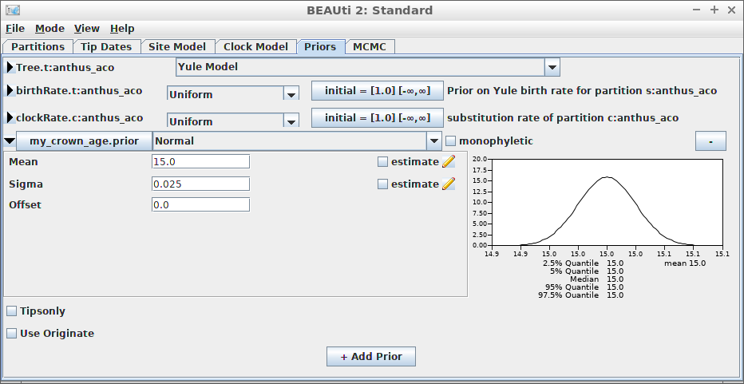

```{r setup, include = FALSE}
knitr::opts_chunk$set(
  collapse = TRUE,
  comment = "#>"
)
```

## Introduction


This vignette shows some examples how to set up different inference models
in `babette`.

For all examples, do load `babette`:

```{r load_babette, results='hide', warning=FALSE, error=FALSE, message=FALSE}
library(babette)
```

All these examples check that `BEAST2` is installed at the default
location at `r get_default_beast2_path()`. If this is not the case,
we will use some fabricated output:

```{r}
posterior <- create_test_bbt_run_output()
posterior$anthus_aco_sub_trees <- posterior$anthus_aco_trees
names(posterior)
```

All examples read the alignment from a FASTA file (usually `my_fasta.fas`).

```{r}
fasta_filename <- get_babette_path("anthus_aco_sub.fas")
```

Instead of a full run, the MCMC chain length is shortened to 10K states,
with a measurement every 1K states:

```{r}
mcmc <- create_test_mcmc(chain_length = 10000)
```

We will re-create this MCMC setup, 
as doing so initializes it with new filenames for
temporary files. 
These temporary files should not exist before a run and should exist
after a run. Sure, there is the option to overwrite...

## Example #1: all default

Using all default settings, only specify a DNA alignment.


```{r example_1, cache=TRUE}
if (is_beast2_installed()) {
  posterior <- bbt_run(
    fasta_filename = fasta_filename,
    mcmc = mcmc
  )
}
```

All other parameters are set to their defaults, as in BEAUti.

```{r fig.width=7, fig.height=7}
plot_densitree(posterior$anthus_aco_sub_trees, width = 2)
```

## Example #2: using an MRCA prior to specify a crown age



An alternative is to date the node of the most recent common ancestor
of all taxa.

Create the MCMC:

```{r}
mcmc <- create_test_mcmc(chain_length = 10000)
```


```{r example_2_mrca, cache=FALSE}
if (is_beast2_installed()) {
  posterior <- bbt_run(
    fasta_filename = fasta_filename,
    mcmc = mcmc,
    mrca_prior = create_mrca_prior(
      taxa_names = sample(get_taxa_names(fasta_filename), size = 3),
      alignment_id = get_alignment_id(fasta_filename),
      is_monophyletic = TRUE,
      mrca_distr = create_normal_distr(
        mean = 15.0,
        sigma = 0.025
      )
    )
  )
}
```

Here we use an MRCA prior with fixed (non-estimated) values of the mean
and standard deviation for the common ancestor node's time.

```{r fig.width=7, fig.height=7}
plot_densitree(posterior$anthus_aco_sub_trees, width = 2)
```

## Example #3: JC69 site model


```{r example_3, cache=TRUE}
if (is_beast2_installed()) {
  posterior <- bbt_run(
    fasta_filename = fasta_filename,
    site_model = create_jc69_site_model(),
    mcmc = mcmc
  )
}
```

```{r fig.width=7, fig.height=7}
plot_densitree(posterior$anthus_aco_sub_trees, width = 2)
```

## Example #4: Relaxed clock log normal


```{r example_4, cache=TRUE}
if (is_beast2_installed()) {
  posterior <- bbt_run(
    fasta_filename = fasta_filename,
    clock_model = create_rln_clock_model(),
    mcmc = mcmc
  )
}
```

```{r fig.width=7, fig.height=7}
plot_densitree(posterior$anthus_aco_sub_trees, width = 2)
```

## Example #5: Birth-Death tree prior


```{r example_5, cache=TRUE}
if (is_beast2_installed()) {
  posterior <- bbt_run(
    fasta_filename = fasta_filename,
    tree_prior = create_bd_tree_prior(),
    mcmc = mcmc
  )
}
```

```{r fig.width=7, fig.height=7}
plot_densitree(posterior$anthus_aco_sub_trees, width = 2)
```

## Example #6: Yule tree prior with a normally distributed birth rate


```{r example_6, cache=TRUE}
if (is_beast2_installed()) {
  posterior <- bbt_run(
    fasta_filename = fasta_filename,
    tree_prior = create_yule_tree_prior(
      birth_rate_distr = create_normal_distr(
        mean = 1.0,
        sigma = 0.1
      )
    ),
    mcmc = mcmc
  )
}
```

```{r fig.width=7, fig.height=7}
plot_densitree(posterior$anthus_aco_sub_trees, width = 2)
```

Thanks to Yacine Ben Chehida for this use case

## Example #7: HKY site model with a non-zero proportion of invariants


```{r example_7, cache=TRUE}
if (is_beast2_installed()) {
  posterior <- bbt_run(
    fasta_filename = fasta_filename,
    site_model = create_hky_site_model(
      gamma_site_model = create_gamma_site_model(prop_invariant = 0.5)
    ),
    mcmc = mcmc
  )
}
```

```{r fig.width=7, fig.height=7}
plot_densitree(posterior$anthus_aco_sub_trees, width = 2)
```

Thanks to Yacine Ben Chehida for this use case

## Example #8: Strict clock with a known clock rate


```{r example_8, cache=TRUE}
if (is_beast2_installed()) {
  posterior <- bbt_run(
    fasta_filename = fasta_filename,
    clock_model = create_strict_clock_model(
      clock_rate_param = 0.5
    ),
    mcmc = mcmc
  )
}
```

```{r fig.width=7, fig.height=7}
plot_densitree(posterior$anthus_aco_sub_trees, width = 2)
```

Thanks to Paul van Els and Yacine Ben Chehida for this use case.
